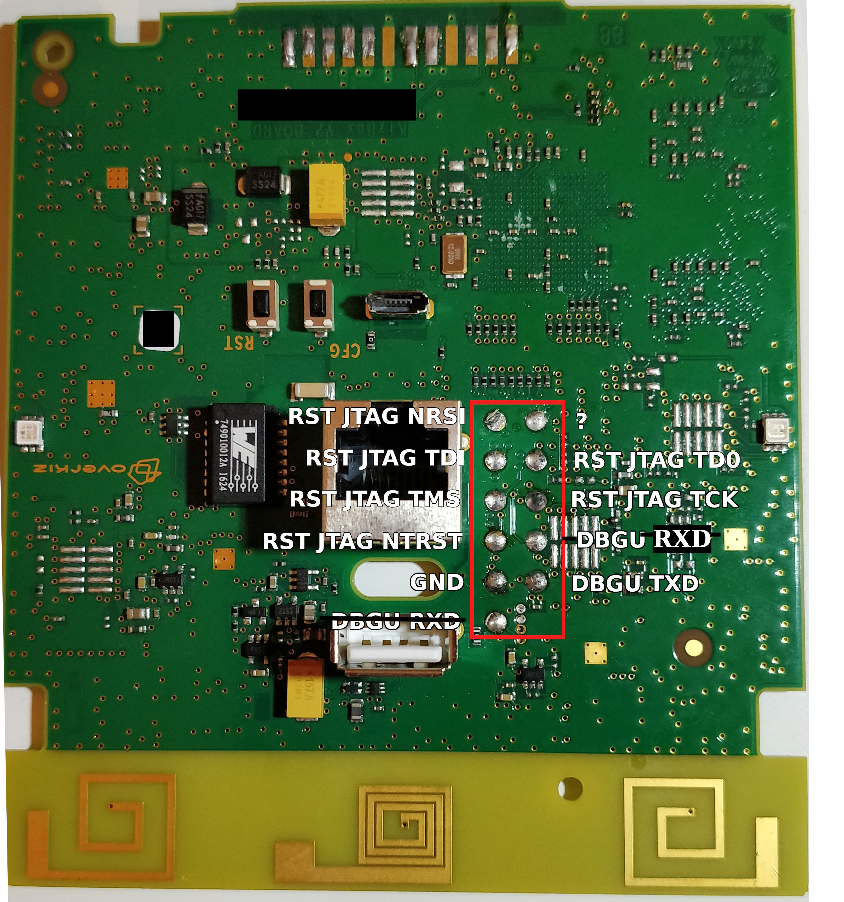
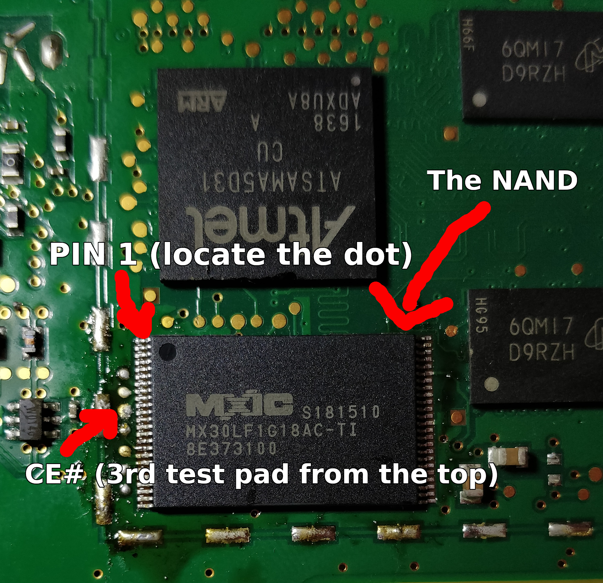

# Instructions to jailbreak the Somfy TaHoma

## Introduction

This is a Work in Progress. No actual end-user solution exists yet based on this research.

It is expected that you have some knowlege on Linux systems. If you don't... Well, there is no point for you to follow this guide at this point and errors could be costly for you.

By following this guide, you accept the risk that your device gets banned or bricked. Hardware manipulation is necessary and any reckless or unprepared action could lead to a permanent hardware failure. You've been warned.

This is a more practical way to jailbreak TaHoma's firmware than desoldering and reading the NAND flash memory. It is exploiting a flaw in the boot process of the ATSAMA5D31 that runs the board.

## The vulnerability

This is not really a vulnerability by itself and is here by design.

The ATSAMA5D31 boot process is as follow:

* Internal ROM (burnt into the SoC) is ran at address 0x0
* It lists all memory devices attached to the SoC (in our case, the NAND flash memory)
* It calls the second stage bootloader from the boot memory device if it finds a valid pattern at the beginning of it.
* If it does not find that pattern, it boots into a recovery/program mode called SAM-BA

By default, the SAM-BA monitor mode is not secured. Details for securing it are under NDA with Atmel. If it would have been secured, a key would have been burnt into one of the SoC fuses and no SAM-BA command could be sent before this key would be provided by the host (meaning we would be screwed).

When the SoC fails to read the boot memory, it boots to SAM-BA mode. It then gets accessible via USB (A-to-A cable) to a host. The host is then able to send commands and data through the USB port.

Using a utility from Atmel, we can dump and write data from and to the NAND flash memory directly through the SoC. That solves several problems, like the ECC and the need for a NAND Flash memory programmer.

## The howto

Last warning, you may cause permanent damage! Please, please, please, take the time to really understand the process before doing anything stupid and read the contents of the scripts. If doing the whole process for the first time takes you less than a full day, you're doing it wrong (or admirably well). If you use your TaHoma for everyday use, enjoy the description but don't risk your unit. 

All the scripts described below are available in the [firmware-modification](../scripts/firmware-modification/) folder. Note that they should stay in the same folder.

### Dumping NAND contents

The main idea is to block the NAND device while the SoC is trying to boot.

You'll need a USB A to A (or C to A if you have a USB-C connector on your host) and a single wire. These can be found for cheap on the Internet.

First of all, you'll need to download the SAM-BA CLI here: https://www.microchip.com/DevelopmentTools/ProductDetails/PartNO/SAM-BA%20In-system%20Programmer

It works in theory under Windows and Linux but Linux should be preferred (see below).

Then you'll need to open the casing (it is held together by several clips) and take the motherboard out.

After opening it, connect the USB-A to USB-A cable between the board and your host.

Locate a group of test pads located near the Ethernet port. Pads definitions are specified in the picture below.



You'll have to solder (or maintain if you don't have any soldering iron) 1 wire on these pads. So connect a cable to **DBGU VCC**. The other end must be let loose and will be used later.

Now is the fun part. Locate your NAND memory. It is beside the SoC (check the picture below).

You'll need to provide 3.3V (for example from DBGU VCC) to the **CE#** pin (see the picture below) at the moment you power on the device. Don't forget to remove it a few seconds after power on.



Don't worry if no LED is powered on after the manipulation. They're not expected to (in fact, if LEDs are powering up, you missed and need to power cycle the device).

If you've done everything correctly, a `lsusb` command (under Linux) should show you the following device:

```
ID 03eb:6124 Atmel Corp. at91sam SAMBA bootloader
```

Now, dump the contents of the flash memory in two parts using SAM-BA:

```
sam-ba -p serial -d sama5d3 -a nandflash:1:8:c0902405 -c read:0x000000:bootstrap.bin:0x20000 -c read:0x20000:ubi-volume.bin
```

The console output should warn you about failed reads. That is expected (to have some warnings at least, most lines should be positive).

You will be left with 2 files: bootstrap.bin, which is the second-level bootloader, and the UBI image which is the actual firmware. Don't disconnect the TaHoma.

### Patch the firmware

These steps have been tried on version 2020.6.4-15 of the "KizOS" distribution. Check yours in `etc/issue`.

To patch the firmware, you'll need the **mtd-utils** package, install it accordingly to your Linux distribution. First of all, run the `1-mountFW.sh` script (it will ask for root rights). It will write the firmware to a simulated NAND flash and then mount it to the folder you designated. You can also create a backup of each volume independently using the `extractFW.sh` script which works pretty much the same way and reconstruct the filesystem as it is organized live.

Both scripts should be given an empty directory as parameter to work properly. Call the script without arguments to get a usage message. Again, read the source code and pay attention to the output of ubinfo. **The layout of your UBI system could be different** (Changes have been observed between different firmware versions) and so **you'll probably have to tweak the scripts yourself**.

Go to the root folder and rename `K06dropbear` to `S06dropbear` in `rc2.S` to `rc5.S` in the `etc` folder. This will activate SSH. Do the same in the rootB folder.

Then, go to the `security` folder (not the one in etc) and replace `authorized_keys` by a SSH public key you generated (be sure to have the associated private key in your own `~/.ssh/` folder). Do the same in `persistent/root/root/.ssh` ([How to generate a SSH key](https://www.ssh.com/ssh/keygen/)). The last step may not be necessary but just let us stay on the safe side.

_(optional)_ Generate a root certificate ([Details on how this could be done](https://gist.github.com/Soarez/9688998)), then a client certificate and key pair. Do not password-protect the private key. The certificate's CN, OU, C, O fields should be your device serial (found in `security/hostname`), Overkiz Root CA, FR, Overkiz (it might work with anything). You may want to use same ciphers as the ones you have in your existing certificates (key length and certificate signature algorithm) but if they are RSA 1024 just know that RSA 2048 works and will cause you less trouble.

A script available [here](../scripts/mitm-certificate) will make the process easier. Another tutorial available [here](./SSLMitm.md) to help you to set up a lab allowing you to effectively Man-In-The-Middle the communication between the TaHoma and Overkiz's servers.

The certificate chain should be similar as the following: Overkiz Root CA -> Server certificate (for later use), Overkiz Client Root CA -> client certificate (for the TaHoma).

Another option could be to modify the curl configuration in `root/etc` and `rootB/etc`. But it is not sure if all HTTPS calls are made through curl.

In `security/envvars` you will also find some domains called, especially for upgrades. Other domains are specified a bit everywhere in the firmware so don't rely too heavily on it...

When you're happy with the changes you made, use the `mount` command with no parameter to note down all UBI volumes mounted (for example `root` on `ubi0_7`) and unmount them, except `persistent`. Then prepare to run `2-updateSecurity.sh` to commit the changes for the security volume and calculate the new MD5 hashes for the volumes.

This is again a step that requires attention. The size of your images could be different from the ones specified in the `2-updateSecurity.sh` script. For root, rootB, and apps, you will have to check the size field in the associated .txt file in `persistent/boot/update` and report it accordingly in the `2-updateSecurity.sh` file before running it. The apps volume is modified in runtime so it is not critical if you don't update the hash.

The hashes listed should be copied into the corresponding files in `persistent/boot/update`. Don't modify the md5-xz field. Don't forget to modify also `version-hash.txt` in the same folder.

This step sounds trivial but the update service may brick the firmware if this is not done properly.

### Flash the patched firmware

Run `3-reconstructUBI.sh` to get a fresh new UBI image. It is not necessary to flash the bootstrap again so we'll do only the UBI image:

```
sam-ba -p serial -d sama5d3 -a nandflash:1:8:c0902405 -c erase:0x20000 -c write:ubi-volume-patched.bin:0x20000 -c verify:ubi-volume-patched.bin:0x20000
```

The verify command doesn't handle very well bad blocks so don't panic if it tells you have errors. Check against the addresses you identified during the read phase at the beginning if you have any doubt.

Power cycle your TaHoma normally. The LEDs should now work as usual (green, blink then red if not connected to the Internet). The first startup may be a bit longer. You should make sure that the TaHoma has no way to go on the Internet (e.g. isolated network). That may let you avoid any ban :)

Also, keep a copy of your original firmware if you want to be able to restore it.

Your patched firmware should await you on the network with an SSH service ready to use. You'll find the IP address by looking for the serial number from the hostname file on your network router.

## Conclusion and status

It is unlikely that this vulnerability will ever be corrected, though not impossible.

If you want to participate just another word of caution (or 2):

* Your serial number (xxxx-xxxx-xxxx) also called `POD_SERIAL` is used to authenticate to the Somfy servers through a certificate associated to it. It is sensitive because if Somfy knows what you're doing, they will ban you
* io-homecontrol frames are encrypted with AES-128. The AES-128 key is stored along the io-homecontrol app in `/apps/overkiz/io-homecontrol/etc/nodes.db`.
* If you didn't understand what is stated here : **don't post online you firmware and expecially security, apps and persistent volumes**
  * You **will** be busted
  * It's illegal in most countries as the firmware is protected by copyright
* Somfy is able to know if you enabled SSH

And that's all for today. Enjoy owning (or bricking) your device, don't hesitate to give feedback and to participate in the efforts.
