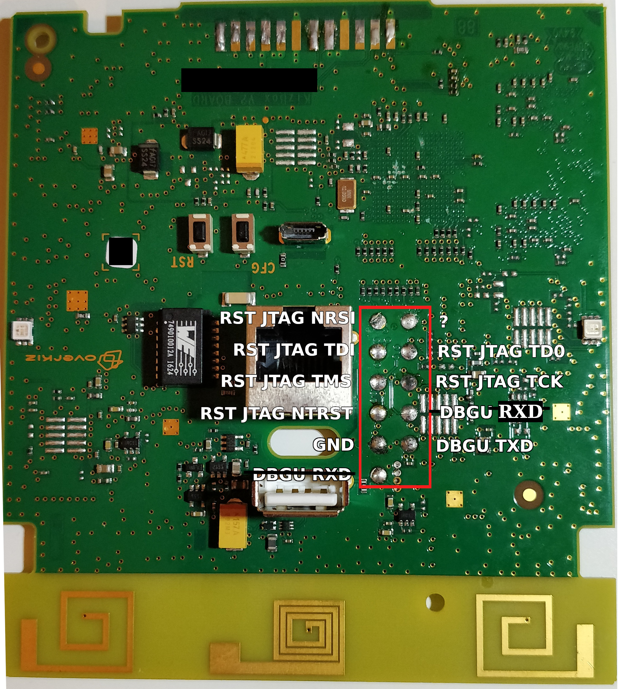

# TaHoma hardware specification and architecture

These information are valid at least for the TaHoma V2 premium (codename: Kizbox 2 with 2 heads). Other members of the Kizbox family have similar hardware (like same SoC family, same configuration for the radio modules, etc.) but could have substantial differences.

See https://github.com/torvalds/linux/blob/master/arch/arm/boot/dts/at91-kizbox2-common.dtsi to have an overview of the common characteristics.

## General characteristics

* SoC: AT91 SAMA5D31 (1 Cortex-A5 CPU @ 536MHz)
* ROM : 1Gb (128Mo) NAND flash memory
* RAM: 2Gb (256Mo) DDR2
* Ethernet 100Mbps using a KSZ8081 controller
* 2 RGB LEDs:
 * pwm:blue:user: on PWM 0 2
 * pwm:green:user: on PWM 0 1
 * pwm:red:user: on PWM 0 0
* 3 buttons on GPIOs:
 * prog (aka CFG): PE27
 * reset (aka RST): PE29
 * user (the capacitive button hidden under the center of the TaHoma): PE31
* USB 2.0 controller and port (USB1)
 * The USB port 2 is also enabled. It has not been located yet but is suspected to be on the connectors allowing to add the Serenity base as the latter provides a USB hub.
* ACT8865 PMIC

## Other architecture information

The TaHoma V2 premium also includes 2 "daughterboards" composed around STM32F101RCT6 microcontrollers. These are in charge of handling the realtime operationes required to run the radio protocols io-homecontrol and RTS.

Both STM32 handle a SI4463 chip. These are the actual transceivers connected to the antennas that receive and emit radio frames. They have the capability to automatically detect the synchronization signal (01010101....) and trigger an interrupt in the STM32 firmware to allow them to handle the incoming information.

Both SI4463 are handled by the STM32 through SPI and direct control through the GPIOs 0 and 1 of the SI4463.

The following (incomplete) schematic sums up the connections between the STM32 and the SI4463 chips:

The USART1 port of the SAMA5D31 SoC is linked to the STM32 in charge of the RTS protocol. It is mapped to /dev/ttyS2 by the Linux Kernel.

The USART2 port of the SAMA5D31 SoC is linked to the STM32 in charge of the io-homecontrol protocol. It is mapped to /dev/ttyS3 by the Linux Kernel and then symlinked to /dev/io.

The UART1 (aka DBGU) port of the SAMA5D31 is linked to debug/programming pads present on the PCB:

